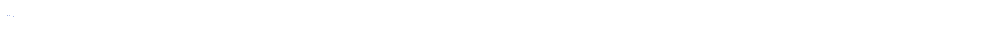

<h1 align="center"> Olá! Seja bem-vindo ao meu perfil
</h1>
 

  

 

Sou estudante de <strong>Desenvolvimento Web</strong> em constante evolução, sempre explorando novas ferramentas, frameworks e abordagens que me permitam criar aplicações eficientes, responsivas e visualmente atraentes. Tenho experiência tanto no front-end, construindo interfaces intuitivas e interativas, quanto no back-end, estruturando soluções robustas e escaláveis.

Além disso, tenho um forte compromisso com boas práticas de código, acessibilidade e performance. Gosto de enfrentar desafios, entender o funcionamento das tecnologias por trás das interfaces e transformar ideias em experiências digitais completas. Aprender algo novo todos os dias é parte essencial da minha jornada.

<h1>📫 Contato</h1>

 

<!--Line-->
 

<h1>🚀 Tecnologias que venho estudando e utilizando:</h1>
 

  <!-- Básico / Web -->
  
  
  
  
  
  
  
  <!-- Frameworks -->
  
  
  
  

  <!-- Backend & DB -->
  
  
  
  

  <!-- Dev Tools -->
  
  
  
  
  
  <!-- WebGL & 3D -->
  
  
  
  <!-- Outros -->
  
  

  

## Demonstration

| Link to my portfolio: [https://gustavo-almeida-portfolio.vercel.app](https://gustavo-almeida-portfolio.vercel.app)

  

---

<h1>🌟 Projetos em Destaque</h1>
 

    <table>
      <thead>
        <tr>
          <th>Projeto</th>
          <th>Tecnologias</th>
          <th>Descrição</th>
        </tr>
      </thead>
      <tbody>
        <tr>
          <td><a href="https://github.com/GustavoAlmeida-cy/memory-game"><strong>Memory Game</strong></a></td>
          <td>React, Next.js, Tailwind, Typescript</td>
          <td>Jogo da memória feito em Next.js, Typescript e Tailwind</td>
        </tr>
        <tr>
          <td><a href="https://github.com/GustavoAlmeida-cy/study-project"><strong>Study</strong></a></td>
          <td>React, Next.js, Tailwind, Typescript</td>
          <td>Projeto educacional feito em Next.js</td>
        </tr>
        <tr>
          <td><a href="https://github.com/GustavoAlmeida-cy/Binary-Calculator-Python"><strong>Binary Calculator</strong></a></td>
          <td>Python, Rich</td>
          <td>Calculadora de números binários escrita em Python</td>
        </tr>
        <tr>
          <td><a href="https://github.com/GustavoAlmeida-cy/Matrixfy"><strong>Matrixfy</strong></a></td>
          <td>HTML, CSS, JS, p5.js</td>
          <td>Matrixfy converte imagens e vídeo em arte ASCII</td>
        </tr>
        <tr>
          <td><a href="https://github.com/GustavoAlmeida-cy/Miv_Kod"><strong>Miv Kod</strong></a></td>
          <td>HTML, CSS, JS</td>
          <td>Um gatinho animado e interativo</td>
        </tr>
      </tbody>
    </table>

 

<!--Line-->
 

<h1>⚙️ GitHub Stats</h1>
  

  

 

<h1>🐍 Snake Contribution Animation</h1>
 

<!--Line-->
 
